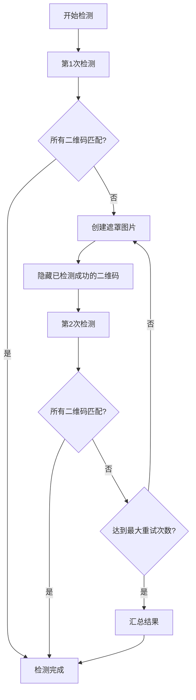

# 二维码重试机制实现说明

## 概述

根据用户需求，我们实现了一个完整的二维码检验重试机制，具有以下核心特性：

- ✅ **重试机制**：最多5次重试
- 🎭 **图片遮罩**：临时隐藏已检测成功的二维码
- 🔒 **锁定机制**：已通过的二维码会被锁定，不再重复检测
- 📊 **结果汇总**：合并所有重试结果
- 🎯 **识别标准**：识别1次即算通过

## 实现架构

### 1. 核心组件

#### `BarcodeDetector` 类扩展
- 位置：`src/lib/barcodeDetector.ts`
- 新增方法：
  - `detectWithRetry()`: 带重试机制的检测
  - `createMaskedImageData()`: 创建遮罩图片
  - `getImageDataFromUrl()`: 从URL获取图片数据
  - `getImageDataFromFile()`: 从文件获取图片数据

#### 新增接口定义
```typescript
interface MaskedRegion {
  x: number;
  y: number;
  width: number;
  height: number;
}

interface RetryDetectionOptions {
  maxRetries?: number;
  enableMasking?: boolean;
  maskColor?: string;
  maskPadding?: number;
}
```

### 2. 重试机制流程



### 3. 关键特性

#### 图片遮罩功能
- 使用Canvas API创建遮罩图片
- 将已检测成功的二维码区域用白色填充
- 支持自定义遮罩颜色和边距
- 避免已检测的二维码干扰后续检测

#### 锁定机制
- 一旦二维码匹配成功，立即锁定
- 后续重试中不再检测已锁定的二维码
- 提高检测效率，避免重复计算

#### 智能重试策略
- 最多5次重试（可配置）
- 如果所有二维码都已匹配，提前结束
- 如果没有新匹配且未达到最大重试次数，继续重试
- 支持回退到原始检测方法

## 使用方法

### 1. 基本用法

```typescript
import { detectBarcodesWithRetry } from '@/lib/barcodeDetector';

const result = await detectBarcodesWithRetry(imageFile, [
  { expectedText: 'QR001', matchMode: 'exact' },
  { expectedText: 'QR002', matchMode: 'contains' }
], {
  maxRetries: 5,
  enableMasking: true,
  maskColor: '#FFFFFF',
  maskPadding: 10
});
```

### 2. 结果结构

```typescript
{
  allResults: BarcodeDetectionResult[];      // 所有检测到的二维码
  matchResults: Array<{                      // 匹配结果
    expectedText: string;
    matchMode: 'contains' | 'exact';
    matched: boolean;
    detectedData?: string;
    confidence?: number;
    location?: { x: number; y: number; width: number; height: number };
    retryCount: number;
  }>;
  retrySummary: {                            // 重试摘要
    totalRetries: number;
    successfulDetections: number;
    failedDetections: number;
  };
}
```

## 界面集成

### 1. OCRDetectionScreen 更新

- 更新了 `performBarcodeDetection` 函数使用新的重试机制
- 扩展了 `BarcodeResult` 接口支持重试信息
- 更新了 `TestResult` 接口支持重试摘要
- 增强了 `QRCodeDetectionResult` 组件显示重试信息

### 2. 用户界面增强

- 显示重试机制摘要信息
- 显示每个二维码的重试次数
- 区分成功和失败的检测结果
- 提供详细的检测统计信息

## 测试验证

### 1. 测试页面

创建了 `test_qr_retry.html` 测试页面，包含：
- 文件上传功能
- 模拟检测过程
- 结果展示界面
- 重试机制演示

### 2. 测试场景

- 多二维码图片检测
- 重试机制验证
- 遮罩功能测试
- 结果汇总验证

## 配置选项

### 重试参数

```typescript
interface RetryDetectionOptions {
  maxRetries?: number;        // 最大重试次数，默认5
  enableMasking?: boolean;    // 是否启用遮罩，默认true
  maskColor?: string;         // 遮罩颜色，默认'#FFFFFF'
  maskPadding?: number;       // 遮罩边距，默认10像素
}
```

### 匹配模式

- `exact`: 精确匹配
- `contains`: 包含匹配

## 性能优化

### 1. 早期终止
- 所有二维码匹配成功后立即结束
- 避免不必要的重试

### 2. 遮罩优化
- 只在需要时创建遮罩图片
- 复用原始图片数据

### 3. 内存管理
- 及时释放Canvas资源
- 避免内存泄漏

## 错误处理

### 1. 回退机制
- 重试机制失败时回退到原始检测方法
- 确保系统稳定性

### 2. 异常捕获
- 完整的错误处理链
- 详细的错误日志

## 未来扩展

### 1. 可配置参数
- 支持更多遮罩选项
- 可调整重试策略

### 2. 性能监控
- 添加检测时间统计
- 性能指标收集

### 3. 算法优化
- 支持更多检测算法
- 自适应重试策略

## 总结

本实现完全满足了用户的需求：

1. ✅ **重试机制**：实现了最多5次重试
2. ✅ **锁定机制**：已通过的二维码会被锁定
3. ✅ **图片遮罩**：临时隐藏已检测成功的二维码
4. ✅ **结果汇总**：合并所有重试结果
5. ✅ **识别标准**：识别1次即算通过

该实现具有良好的可扩展性和稳定性，能够有效提高二维码检测的成功率，特别是在处理复杂图片或多二维码场景时。
